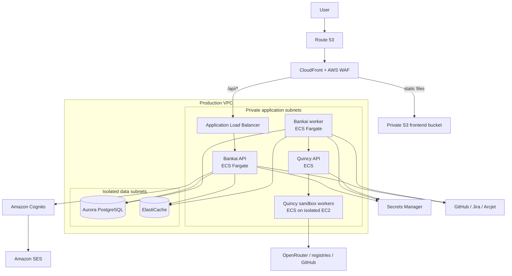

# Bankai AWS Migration — Step 1: Target Architecture

Status: Draft for owner approval
Created: 2026-09-14
Scope: Bankai and Quincy, development through production

## 1. Objective

Move Bankai's hosted application infrastructure to AWS, including the frontend,
API, background workers, PostgreSQL, authentication, Redis, email delivery, and
the Quincy security/remediation engine.

The following remain external integrations rather than hosted components:
GitHub, Jira Cloud, OpenRouter, Arcjet, and public package registries.

## 2. Working decisions

These are the recommended defaults. Items marked **OWNER INPUT REQUIRED** must
be confirmed before Step 2 begins.

| Decision | Working choice | Status |
| --- | --- | --- |
| Migration depth | Replace Supabase hosting and Supabase Auth | Proposed |
| Primary AWS Region | `ap-south-1` (Mumbai) | Approved 2026-09-14 |
| DR AWS Region | `ap-south-2` (Hyderabad) | Approved as recovery region; no always-on duplicate stack initially |
| Infrastructure as code | AWS CDK with TypeScript | Proposed |
| Environments | Separate non-production and production AWS accounts | Proposed |
| PostgreSQL | Aurora PostgreSQL Serverless v2 | Proposed; validate cost and extensions |
| Customer identity | Amazon Cognito User Pool | Proposed |
| Queue/cache | ElastiCache for Valkey or Redis OSS, Multi-AZ in production | Proposed |
| Bankai compute | ECS Fargate, separate API and worker services | Proposed |
| Quincy API | ECS service in private subnets | Proposed |
| Quincy sandbox workers | ECS on a dedicated EC2 Auto Scaling Group | Proposed |
| Frontend | Private S3 origin behind CloudFront | Proposed |
| Public API ingress | CloudFront `/api/*` behavior to ALB | Proposed |
| DNS/TLS | Route 53 and ACM | Proposed |
| Secrets | Secrets Manager with KMS encryption | Proposed |
| CI/CD access | GitHub Actions to AWS through OIDC; no static AWS keys | Proposed |

The application domain is `bankaisecurity.com`. Route 53 can host the zone, but
the existing DNS provider and registrar must be recorded before any nameserver
change. No DNS changes are part of Step 1.

## 3. Target topology



## 4. Current-system inventory

### Bankai runtime

| Component | Current evidence | AWS implication |
| --- | --- | --- |
| React/Vite frontend | `frontend/`, built and served by nginx | Build once; publish immutable assets to S3/CloudFront |
| Express API | `backend/src/server.ts` | Independent ECS service with health checks and autoscaling |
| BullMQ worker | `backend/src/worker.ts` | Independent ECS service using the same image with a different command |
| Four queues | repo scan, fix PR, CI pipeline, fix retry | Redis connectivity and graceful worker draining are mandatory |
| PostgreSQL/Auth | Supabase client and SQL migrations | Database and identity must be migrated as separate workstreams |
| Quincy client | `backend/src/lib/quincy.ts` | Private service discovery and service authentication required |

The current `docker-compose.yml` starts the Bankai API, Redis, and frontend, but
does not start the separate Bankai worker or Quincy. It is therefore a local
convenience topology, not the production topology to reproduce in AWS.

### Database and authorization

- There are currently 31 ordered SQL migrations.
- At least 44 application source files reference Supabase.
- RLS policies and stored procedures rely on `auth.uid()` and `auth.jwt()`.
- `profiles.id` references `auth.users(id)` and is populated by an auth-schema
  trigger.
- The database contains application triggers and security-definer functions
  that must be tested on the selected Aurora/RDS PostgreSQL version.
- Existing user UUIDs and encrypted integration credentials must retain their
  identity relationships during migration.

Consequently, migration to Aurora is not just a PostgreSQL dump and restore.
The AWS-compatible schema must provide an equivalent request identity to RLS,
or authorization must move into a carefully tested application data layer.
The preferred design is to retain database RLS as defense in depth and set
transaction-local user identity from verified Cognito claims.

### Existing-user password continuity

The owner requires the existing 5–10 production users to keep their passwords.
The working approach is Cognito just-in-time migration:

1. An existing user submits their current email and password to Cognito.
2. For a user not yet in Cognito, a tightly scoped Cognito migration Lambda
   authenticates those credentials against Supabase Auth.
3. On success, Cognito creates a confirmed user with verified attributes and
   subsequent logins use Cognito directly.
4. The migration Lambda must never log its input because the event contains the
   submitted password.
5. After every active user has migrated, or after an agreed migration window,
   disable the Lambda and remove its Supabase credentials.
6. Users who do not log in during the window use the password-reset flow.

This design must be proven in non-production before it is accepted. User UUID
mapping also needs an explicit compatibility table because Cognito `sub` values
must not silently replace IDs referenced throughout the existing database.

### Secrets and configuration

Values must be inventoried by name only; secret values must never enter this
document or source control.

| Name | Type | Planned destination |
| --- | --- | --- |
| `SUPABASE_URL` | Replaced configuration | Aurora endpoint through runtime config |
| `SUPABASE_ANON_KEY` | Retired secret | Cognito/app configuration |
| `SUPABASE_SERVICE_ROLE_KEY` | Retired secret | IAM database/app service roles |
| `ARCJET_KEY` | Secret | Secrets Manager |
| `TOKEN_ENC_KEY` | Critical encryption secret | Preserve initially in Secrets Manager; plan KMS migration |
| `OPENROUTER_API_KEY` | Secret | Secrets Manager, scoped to Bankai/Quincy roles |
| `QUINCY_API_TOKEN` | Service secret | Secrets Manager or IAM-based internal authentication |
| `GITHUB_OAUTH_CLIENT_ID` | Configuration | Parameter Store/runtime configuration |
| `GITHUB_OAUTH_CLIENT_SECRET` | Secret | Secrets Manager |
| `REDIS_URL` | Generated configuration | ElastiCache endpoint in runtime configuration |
| `FRONTEND_ORIGIN` | Configuration | CloudFront/custom-domain origin |
| `BACKEND_PUBLIC_URL` | Configuration | Public CloudFront/API URL |

`TOKEN_ENC_KEY` must be preserved through the first migration. Rotating or
losing it would make existing encrypted GitHub and Jira credentials unreadable.

## 5. Quincy security boundary

Quincy executes scanners, builds, tests, and AI-generated changes inside Docker
sandboxes. Treat this as untrusted compute.

Required controls:

1. Quincy sandbox workers do not share a host with the Bankai API or database.
2. Workers run in private subnets with no inbound route from the internet.
3. Worker IAM roles cannot read Bankai database or Cognito secrets.
4. Outbound traffic is restricted to approved endpoints where practical.
5. Workspaces and job credentials are ephemeral and removed after each job.
6. Docker control access is never exposed to the Bankai API container.
7. Worker instances are replaceable and regularly recycled.
8. Job input, output, timeout, disk, CPU, memory, and concurrency are bounded.
9. Quincy job state is durable enough for worker/task replacement and deploys.
10. A later architecture review may replace Docker-on-EC2 with a stronger
    per-job isolation model, but this is not a prerequisite for the first move.

## 6. Account and environment boundary

Recommended AWS Organizations structure:

| Account | Purpose |
| --- | --- |
| Management | Organizations, Control Tower, billing only; no workloads |
| Log archive | Immutable centralized organization logs |
| Audit/Security | Security tooling and read-only audit access |
| Non-production | Development, integration, and staging workloads |
| Production | Customer-facing Bankai and Quincy workloads |

For a cost-constrained first phase, management, non-production, and production
are the minimum acceptable separation. Production must not run in the AWS
Organizations management account.

## 7. Initial reliability targets

| Measure | Working target | Status |
| --- | --- | --- |
| Production availability | 99.9% | **OWNER INPUT REQUIRED** |
| PostgreSQL RPO | 5 minutes | **OWNER INPUT REQUIRED** |
| PostgreSQL RTO | 60 minutes | **OWNER INPUT REQUIRED** |
| API/worker RTO | 30 minutes | **OWNER INPUT REQUIRED** |
| Quincy RTO | 60 minutes | **OWNER INPUT REQUIRED** |
| Database backup retention | 35 days | Proposed |
| Audit-log retention | 1 year minimum | **OWNER INPUT REQUIRED** |
| Planned database cutover | Up to 30 minutes read-only | **OWNER INPUT REQUIRED** |

For planning, the provisional cutover allowance is 30 minutes. This is not yet
a promise that the migration will require downtime; the later rehearsal must
measure it and establish a rollback deadline.

### Provisional cost guardrail

User count is low (5–10), but Quincy compute and the desired security/availability
boundaries—not page traffic—will dominate cost. Until a service-by-service AWS
Pricing Calculator estimate is produced, use these planning controls:

- Design target: no more than USD 400/month for non-production and production
  combined at low Quincy utilization.
- Review threshold: USD 500/month forecast.
- Initial AWS Budget notifications: USD 200, USD 320, USD 400 actual, and USD
  500 forecast.
- Quincy EC2 workers scale to zero when the queue is empty in non-production.
- Do not keep a full always-on copy of the stack in Hyderabad initially; use
  cross-Region backups and infrastructure code, then add warm standby when the
  business RTO requires it.
- Do not buy Savings Plans or Reserved capacity until at least 30 days of
  representative usage has been measured.

The USD 400 figure is a design constraint, not a bill estimate or spending cap.
Step 1 still requires a calculator estimate based on chosen task sizes, database
capacity, NAT/data transfer, log volume, and Quincy execution hours.

## 8. Known migration risks

| Risk | Impact | Required mitigation |
| --- | --- | --- |
| Cognito and Supabase issue different tokens | Existing sessions and middleware will not work | Add an identity adapter and perform a controlled session cutover |
| Password hashes might not be portable | Existing users could lose seamless login | Validate supported export/import; otherwise use just-in-time migration or forced reset |
| SQL depends on Supabase `auth` schema | RLS and RPCs fail on Aurora | Add AWS-compatible identity functions and migration tests |
| Long-running jobs are interrupted | Duplicate PRs or abandoned remediation | Preserve idempotency/checkpoints and implement graceful task draining |
| Redis failover loses unsafe job state | Delayed or duplicated jobs | Multi-AZ, persistence settings, retry testing, and idempotent handlers |
| Quincy executes untrusted code | Host or credential compromise | Dedicated EC2 capacity and least-privilege isolation |
| Public URLs change | OAuth and GitHub webhooks fail | Pre-register callbacks and use a rehearsed DNS/webhook cutover |
| Encryption key is lost or rotated early | Stored integration credentials cannot decrypt | Preserve `TOKEN_ENC_KEY`; rotate only with a data re-encryption procedure |
| Database feature mismatch | Schema import or runtime failures | Test all migrations/functions on the exact Aurora engine version |

## 9. Owner questionnaire

Complete these fields before Step 2:

```text
AWS organization/account already exists: yes / no
Primary region: ap-south-1 / other:
DR region: ap-south-2 / other / none initially:
Domain to use:
Current DNS provider:
Monthly non-production budget ceiling (USD or INR):
Monthly production budget ceiling (USD or INR):
Expected monthly active users at launch:
Expected concurrent repository scans:
Expected concurrent Quincy remediations:
Current production database size:
Data residency or compliance requirements:
Existing users must retain passwords: yes / no / unknown
Maximum acceptable planned cutover downtime:
Required audit-log retention:
Named AWS/infrastructure owner:
Named security owner:
```

### Owner responses received 2026-09-14

```text
AWS account already exists: yes
AWS Organizations status: standalone account; console offers "Create an organization"
Primary region: ap-south-1 (Mumbai)
DR region: ap-south-2 (Hyderabad)
Domain: bankaisecurity.com
Monthly budget ceiling: unknown; provisional design target USD 400/month
Current production users: 5–10
Maximum planned cutover downtime: unknown; provisional allowance 30 minutes
Existing users must retain passwords: yes
```

Still required from the owner or AWS account inventory:

```text
Current DNS provider and domain registrar:
Current production database size:
Expected concurrent repository scans:
Expected concurrent Quincy remediations:
Data residency or compliance requirements:
Required audit-log retention (working default: one year):
Named AWS/infrastructure owner:
Named security owner:
```

## 10. Step 1 exit criteria

- [ ] The owner questionnaire is complete.
- [x] Existing AWS account/Organizations state identified: standalone account.
- [ ] Replacing Supabase database hosting and Auth is explicitly approved.
- [ ] Primary and DR Regions are approved.
- [ ] AWS account/environment boundaries are approved.
- [ ] A monthly cost ceiling is recorded.
- [ ] Availability, RPO, RTO, backup, and audit retention are approved.
- [ ] Quincy isolation on dedicated ECS/EC2 capacity is approved.
- [ ] Existing user migration feasibility has been investigated.
- [ ] PostgreSQL extensions, functions, triggers, and RLS dependencies have a
      machine-verifiable compatibility inventory.
- [ ] Secret names and owners are inventoried without exposing their values.
- [ ] This architecture record is approved and its open decisions are closed.

Step 2 begins only after these criteria are satisfied. Step 2 will establish
the AWS landing zone, access model, budgets, organization-wide audit logging,
and the CDK project skeleton; it will not yet migrate production traffic.
